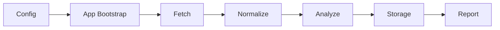

<div align="center">
  <h1>TrendRadar Rust</h1>
  <p>This is a Rust translation of <a href="https://github.com/sansan0/TrendRadar">TrendRadar</a>, licensed under GPL-3.0.</p>
  <p>基于原始 Python 版 TrendRadar 的 Rust 工作区重构，目标是先收敛一个可验证、可维护、适合 AI 协作推进的趋势监控内核。</p>
  <p><em>Rust Workspace Migration · Trend Monitoring Kernel · AI Collaboration</em></p>
  <p>
    <a href="#快速开始">快速开始</a> ·
    <a href="#文档导航">文档导航</a> ·
    <a href="./docs/architecture.md">架构</a> ·
    <a href="./docs/migration-strategy.md">迁移策略</a>
  </p>
</div>

## 原始项目与翻译声明

| 项目 | 信息 |
| --- | --- |
| 原始项目 | [TrendRadar](https://github.com/sansan0/TrendRadar) |
| 原始许可证 | GPL-3.0（见 [LICENSE](./LICENSE)） |
| 翻译语言 | Python → Rust |
| 翻译许可证 | GPL-3.0（与原始项目一致） |
| 主要修改 | 从 Python 重构为 Rust workspace 架构，重组模块边界，删除历史兼容层，新增验证闭环 |

本仓库是 TrendRadar 的衍生作品。所有翻译和修改部分同样遵循 GPL-3.0，保留原始版权声明，并标注修改范围。

## 项目简介

TrendRadar Rust 不是把旧系统逐文件翻译成 Rust，而是围绕“配置 -> 抓取 -> 归一化 -> 分析 -> 存储 -> 输出”这条主链路，重新建立一个更小、更稳、更容易验证的趋势监控内核。

当前仓库仍处于环境准备和迁移基线收敛阶段。它已经具备 Rust workspace、验证入口、Git 协作约束、系统测试模板和迁移文档，但默认还不把旧 Python 系统的全部业务逻辑直接搬过来。

## 为什么需要这个仓库

- 原始系统经历过长期演化，已经累积了不少对迁移和协作不友好的历史包袱。
- 如果直接照搬旧实现，新的 Rust 代码会继承过大的边界、过重的兼容层和难以验证的行为。
- 在正式进入功能迁移之前，先把 workspace、验证闭环、文档基线和协作规则收口，能显著降低后续多人并行推进时的返工成本。

## 适用场景

- 想把趋势监控、RSS、新闻聚合这类系统从动态语言迁到 Rust，但不想做机械翻译。
- 想先搭建可验证的工程基线，再逐步迁移抓取、分析、存储和输出链路。
- 想让 AI agent 与人工开发者在同一套 Git、文档和验证规则下协作推进。

## 当前核心能力

- **Workspace 基线**：8 个 crate 已按职责拆分，围绕领域、配置、调度、分析、存储、抓取、报告和应用编排建立工作区骨架。
- **固定工具链**：仓库固定 Rust `1.85.0`，并显式纳入 `rustfmt`、`clippy`、`rust-analyzer`、`rust-docs` 等组件。
- **验证闭环**：`just env-check`、`just verify-basic`、`just verify` 和 `just doc` 提供环境检查、基础验证、完整验证和文档生成入口。
- **协作约束**：`.githooks/`、`.gitmessage`、分支规范和提交规范已经落地，适合并行迁移阶段使用。
- **迁移基线文档**：架构、模块映射、不变量、契约和并行迁移方案已经进入 `docs/`，可以作为后续实现与审查的统一参照。

## 架构概览



当前已经落地并验证的是两条链路：`config -> app::bootstrap` 的基础启动校验，以及基于 fixture 的 `config -> fetch -> analyze -> storage -> report` 最小闭环。与此同时，Wave 3 已开始围绕 `domain`、`schedule`、`analyze`、`fetch`、`storage`、`report`、`app` 补边界样例与系统 fixture，使核心 crate 的行为不只“能跑通”，也“可复查”。更复杂的抓取策略、持久化形态和报告能力仍按迁移计划逐步进入 Rust 内核，而不是一次性重写整套旧系统。

## 当前状态

- 当前阶段：迁移基线收敛，已进入 Wave 3 边界样例扩展
- 已验证内容：`just env-check`、`just verify-basic`、`just doc`、`config -> app::bootstrap` 启动链路、`config -> fetch -> analyze -> storage -> report` fixture 系统链路、多个 crate 级边界样例，以及根级 `tests/system/` 下 62 条成功路径 / 空输入 / 错误路径 / 阶段组合样例
- 已建立内容：CI 基础验证、系统测试模板、Git hooks、提交模板、并行迁移规则
- 当前不包含：完整抓取链路、真实存储实现、完整报告层、通知渠道、AI / MCP 扩展能力

## 快速开始

### 环境要求

- Rust `1.85.0`
- `just`
- `cargo-nextest`
- `cargo-llvm-cov`
- `cargo-deny`

推荐直接使用仓库脚本完成环境准备：

```bash
./scripts/bootstrap.sh
```

然后执行最小验证：

```bash
just env-check
just verify-basic
just doc
```

如果你想手动安装工具链、扩展工具和 Git hooks，见 [环境准备文档](./docs/environment-setup.md)。

## 常用命令

| 命令 | 作用 |
| --- | --- |
| `just env-check` | 检查 Git、Rust 工具链、组件和扩展命令是否齐全 |
| `just install-githooks` | 启用仓库内 `.githooks/` 和提交模板 |
| `just fmt` / `just fmt-check` | 格式化或检查格式 |
| `just check` | 执行工作区编译检查 |
| `just test-basic` | 运行 `cargo test --workspace` |
| `just test` | 运行 `nextest` 和 doctest |
| `just verify-basic` | 执行 `fmt-check + check + test-basic` |
| `just verify` | 执行 `fmt-check + lint + test` |
| `just doc` / `just doc-open` | 生成或打开本地 API 文档 |

`just doc` 底层执行的是 `cargo doc --workspace --no-deps`，产物位于 `target/doc`。

## 工作区结构

| 路径 | 作用 |
| --- | --- |
| `crates/domain` | 领域模型、共享错误、运行元数据 |
| `crates/config` | 配置模型、默认值和加载入口 |
| `crates/schedule` | 调度规则解析 |
| `crates/analyze` | 过滤、聚合、排序等纯逻辑 |
| `crates/storage` | 存储抽象和后续本地持久化实现 |
| `crates/fetch` | 热点源和 RSS 抓取适配 |
| `crates/report` | 结构化输出和后续报告层 |
| `crates/app` | 编排与 CLI 入口 |
| `docs/` | 迁移策略、架构、约束和开发日志 |
| `fixtures/` | 系统测试样例目录 |
| `tests/` | 跨 crate 测试说明与快照目录 |

## 文档导航

- [架构说明](./docs/architecture.md)
- [环境准备](./docs/environment-setup.md)
- [迁移策略](./docs/migration-strategy.md)
- [实施计划](./docs/implementation-plan.md)
- [后续拓展执行文档](./docs/extension-execution-plan.md)
- [并行迁移总方案](./docs/parallel-migration-plan.md)
- [契约文档目录](./docs/contracts/README.md)
- [实施文档目录](./docs/implementation/README.md)
- [实现验收矩阵](./docs/acceptance-matrix.md)
- [模块映射基线](./docs/module-map.md)
- [迁移不变量](./docs/invariants.md)
- [契约基线](./docs/api-contracts.md)
- [系统性测试模板](./docs/system-test-template.md)
- [Git 工作流与提交规范](./docs/git-workflow.md)
- [开发日志](./docs/dev-journal/README.md)

## 协作与贡献

当前仓库主要用于个人 Rust 学习与迁移实践，但欢迎围绕这些方向提交 Issue、PR 或讨论：

- Rust workspace 结构与 crate 边界
- 迁移基线文档与验证闭环
- AI 辅助协作规则和 Git 规范
- 趋势监控、RSS、聚合和排序的 Rust 建模

提交前至少建议运行：

```bash
just env-check
just verify-basic
```

更多规则见 [CONTRIBUTING.md](./CONTRIBUTING.md) 与 [AGENTS.md](./AGENTS.md)。

## 友情链接

- [Linux.do](https://linux.do) — 开源技术与 AI 实践社区

## License

```
TrendRadar Rust — Rust translation of TrendRadar
Copyright (C) TrendRadar Contributors (original Python version)
Copyright (C) 2026 TrendRadar Rust Contributors

This program is free software: you can redistribute it and/or modify
it under the terms of the GNU General Public License as published by
the Free Software Foundation, either version 3 of the License, or
(at your option) any later version.

This program is distributed in the hope that it will be useful,
but WITHOUT ANY WARRANTY; without even the implied warranty of
MERCHANTABILITY or FITNESS FOR A PARTICULAR PURPOSE. See the
GNU General Public License for more details.
```

完整许可证文本见 [LICENSE](./LICENSE)。

本仓库是 [TrendRadar](https://github.com/sansan0/TrendRadar) 的衍生作品，沿用 GPL-3.0-only 许可策略。所有修改与新增内容同样遵循 GPL-3.0。
